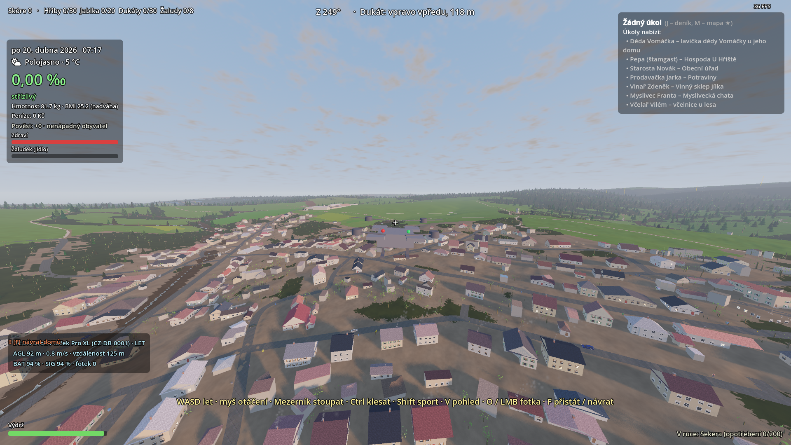
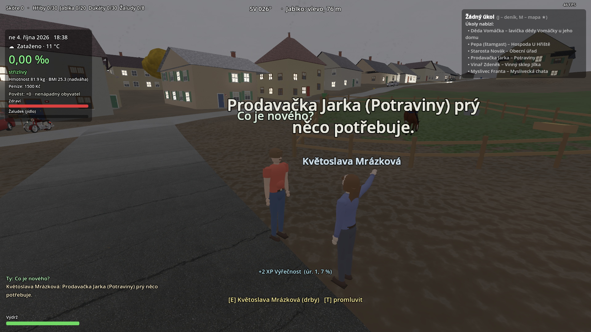
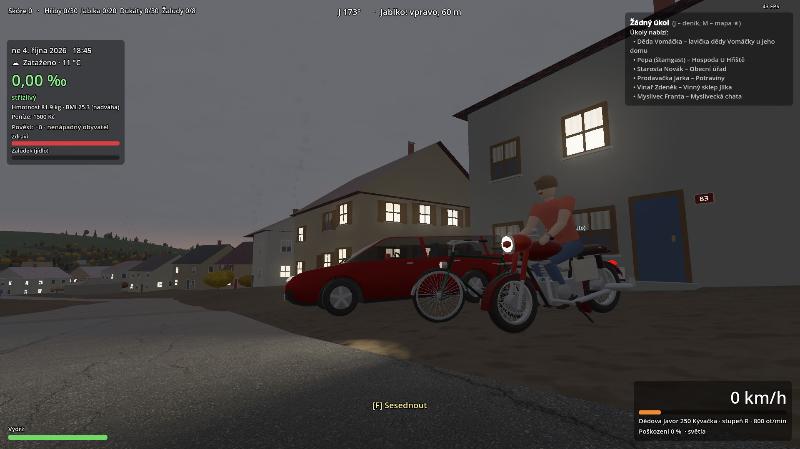
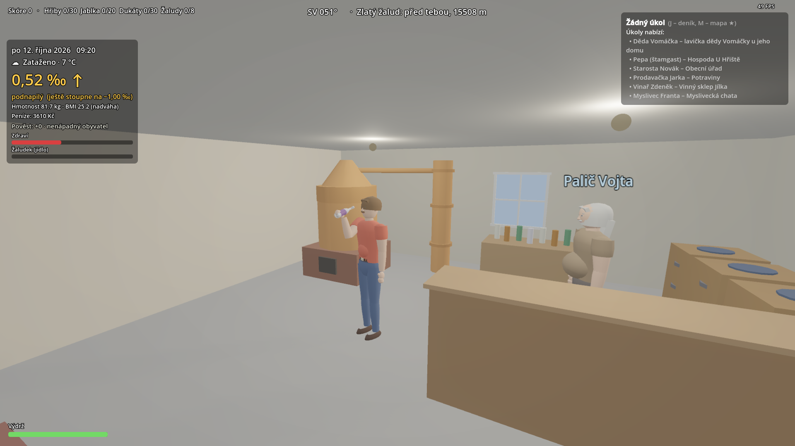
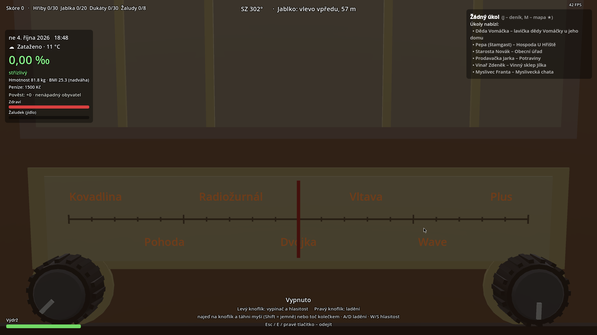

# Stone & Clay – herní verze mapy (MVP)

Open-world MVP v **Godot 4.3** nad detailní mapou ~11,3 × 7,5 km – katastr obce Dukelčic
plus katastry pěti okolních obcí (`blend/mapa_okoli.blend` + rozšíření v Pythonu – terén
DMR 5G, budovy s výškami z DMP 1G, silnice z OSM, ~51 700 stromů; barva terénu je
procedurální, ortofoto ČÚZK jen na přepnutí).

> *„Tato hra je satirickým uměleckým dílem. Všechny postavy, události a vyobrazené soukromé objekty
> jsou smyšlené. Jakákoliv podobnost se skutečnými osobami či konkrétními obydlími je čistě náhodná.“*

*Veřejný snapshot — vývoj probíhá v privátním repozitáři, historie commitů je zde squashnutá.*

## Screenshoty

| Letecký pohled na Dukelčice (dron) | Dialog s NPC na návsi |
|---|---|
|  |  |

| Motorka Javor 250 Kývačka za soumraku | Interiér pálenice |
|---|---|
|  |  |

| Rádio se stanicemi |
|---|
|  |

## Spuštění

```bash
./run.sh            # nebo: godot --path stone-and-clay
```

První spuštění naimportuje textury (~30 s). Načtení světa trvá ~2 s.

## O hře

**Dukelčice** je open-world simulátor života na české vesnici na věrné 3D mapě skutečného
katastru. Hráč se volně pohybuje pěšky, autem, na koni i ve vzduchu (dron, letadlo, paramotor,
motorové rogalo), plní drobné vesnické úkoly a nese si jejich následky – alkohol v krvi, policejní
kontroly, poškozené auto. Pod jednoduchým, laskavě humorným povrchem běží uvěřitelná simulace:
fyziologie, počasí a roční doby, doprava a policie, ekonomika, práce, zvěř a lov, hospodářství,
zahrada a desítky dalších systémů.

Kolem katastru leží pět okolních obcí s fiktivními názvy (Břehatice, Bohulečice, Březouchy,
Velký Oříškov, Hřiváčův Újezd) – jsou součástí detailní mapy: skutečná zástavba s kolizemi,
průjezdné silnice a zóna „v obci“ (limit 50 km/h), ale zatím bez vlastního herního obsahu
(úkoly, práce a příběh zůstávají v Dukelčicích); hráč vždy startuje v Dukelčicích.

Vize, pilíře a herní smyčka: [`GAME_DESIGN.md`](GAME_DESIGN.md).
Úplný technický rozpis všech implementovaných systémů: [`docs/SYSTEMS.md`](docs/SYSTEMS.md).

## Ovládání

| klávesa | pěšky | v autě |
|---|---|---|
| WASD / šipky | chůze | W plyn, S brzda / couvání, A/D řízení |
| myš | rozhlížení (klikni do okna) | rozhlížení kamerou |
| Shift | sprint (výdrž) | – |
| Mezerník | skok (delší stisk = výš) | ruční brzda |
| Ctrl / C | přikrčení, ve sprintu skluz | – |
| V | 1. ↔ 3. osoba | kamera za autem ↔ z interiéru |
| kolečko myši | vzdálenost kamery | – |
| E | interakce (místa, dveře, NPC, nocleh…) | – |
| T / Enter | říct něco nahlas (nejbližší/oslovená postava odpoví) | také |
| F5 / F9 | rychlé uložení / načtení pozice | také |
| F | nastoupit do auta / na kolo, motorku, koně | vystoupit / sesednout |
| L / B / N / R | – | světla / klakson / stěrače / postavit vozidlo |
| G | zvednout/naložit náklad, nebo hvízdnout na koně | – |
| X (držet) | dalekohled | – |
| Q, 1–5 | vybrat / přepnout nástroj v ruce | – |
| P | panel dokladů (řidičák, skupiny, body, zákaz) | – |
| LMB | kontextová akce (sběr, rybaření, střelba…) | – |
| RMB (držet) | míření se zbraní v ruce | – |
| Tab / I / J / K / M / H | inventář / oblečení / deník úkolů / dovednosti / mapa / domů | |
| M (mapa) | kolečko = zoom ke kurzoru, tažení = posun; mapa se překresluje jen při změně pohledu (marker hráče ~4× za s) | zavřít: M / Esc |
| U | vysvobození ze zaseknutí | – |
| F1 / Esc / F2 | nápověda / pauza a nastavení (mj. přepínač „Třes obrazu“ – abstinence a zima, ukládá se do `nastaveni.cfg`) / herní menu (čas, počasí, teleport…) | |

Místa mají otevírací doby (`Place.HOURS` / `WEEK_HOURS`, výpis `hours_text()` ukazuje i víkend). Zavřené místo
od dveří nenabízí práci, úkoly ani zboží (`World.buy` to hlídá taky) a obsluha stojí venku jen v otevírací době.
Obecní úřad má úřední dny (Po a St 7–17, Út a Čt 8–14, Pá 8–12, víkend a svátky zavřeno). F2 → Teleport
má sekci „Okolní obce“ (postaví tě na okraj katastru čelem k obci; obce jsou jen pohled z dálky).

Funguje i herní ovladač. Ovládání koně, dronu, letadla, paramotoru a motorového rogala
(startovní procedury, přistání, licence) je v [`docs/CONTROLS.md`](docs/CONTROLS.md).

## Realismus (M8, probíhá)

Milník **M8 Realistický svět** mění krajinu a vesnici z „kulis“ na propojené zjednodušené
fyzikální/ekologické modely (terén, voda, slunce, vítr → co kde roste a žije). Jde vypnout po
krocích: Esc → Nastavení → „Realismus (M8)…“. M8.1 (základ) jen zakládá API pro další kroky:

| klíč (`GameSettings.realism`) | krok M8 | co zapíná |
|---|---|---|
| `gait` | M8.6 | **Pohyb člověka** (`scripts/gait.gd`): fázová chůze/běh, chodidla bez klouzání, náklon do svahu, náklad/únava/chlad → postoj; vypnuto = stará animace |
| `site`, `species`, `wind`, `sky`, `soil_water`, `treegen`, `micro`, `animal_gait`, `phenology`, `crops`, `terramech`, `ground_veg`, `habitat`, `thermo`, `village_life`, `soundscape` | M8.2–M8.18 | výchozí zapnuto; konkrétní popisek a cena v menu přibude s krokem, který klíč zavádí |

Měření výkonu po krocích M8: `--perfscene=<jméno>[,sekund]` (`ves_poledne`, `les_rano_mlha`,
`louka_vitr`, `udoli_noc`, `pole_leto`, `dron_200m`) teleportuje na pevnou scénu a změří FPS/CPU/GPU
stejně jako `--perf` → `user://perf/<jméno>.csv`. Pro pohodlné posílání výsledků použij
`tools/launcher.sh --perfscene=ves_poledne` (viz tabulka nástrojů níž) – zapíše kompaktní log do
`logs/` místo ručního přepisování čísel z konzole. F2 → „Příroda – ladění…“ nechá mapu (M) kreslit
barevnou mřížku stavu modelu (zatím jen ukázková prázdná vrstva). Podrobnosti:
[`docs/DEV.md`](docs/DEV.md) → „Ladicí parametry“, kontrakt API mezi kroky
[`prompts/roadmapa/M8_realismus/00_PRINCIPY.md`](prompts/roadmapa/M8_realismus/00_PRINCIPY.md).

## Dokumentace

- [`GAME_DESIGN.md`](GAME_DESIGN.md) – vize, pilíře, herní smyčka, cílové parametry
- [`docs/SYSTEMS.md`](docs/SYSTEMS.md) – úplný technický rozpis všech herních systémů (fyziologie, ekonomika, zákon, zvěř, práce, letectví…)
- [`docs/CONTROLS.md`](docs/CONTROLS.md) – ovládání koně, dronu, letadla, paramotoru, trikeu
- [`docs/DEV.md`](docs/DEV.md) – jak vzniká herní mapa z geodat, ladicí/testovací parametry spouštění, architektura kódu (příprava na multiplayer)

### Návody

- [`BLENDER_UPRAVY.md`](BLENDER_UPRAVY.md) – ruční úpravy mapy v Blenderu (budovy, silnice, stromy, terén, textury) a export do hry
- [`VLASTNI_VOZIDLA.md`](VLASTNI_VOZIDLA.md) – nová auta (procedurálně i z vlastního `.glb` modelu), kola a motorky
- [`ASSETY.md`](ASSETY.md) – legální assety z internetu: kde hledat, checklist licencí, import, registr `assets/LICENSES.md`, `tools/assets_check.py`
- [`ZVIRATA.md`](ZVIRATA.md) – úprava zvířat, ptáků, počasí a ročních období (tabulky, náhled `zoo.gd`)

## Add-ony a nástroje

Projekt používá čtyři open-source add-ony (všechny MIT – kompletní rozpis s licencemi
je v [`THIRD_PARTY.md`](THIRD_PARTY.md)):

| add-on | verze | umístění | k čemu |
|---|---|---|---|
| Godot Jolt | 0.13.0-stable | `addons/godot-jolt/` | fyzikální jádro místo Godot Physics (`3d/physics_engine="Jolt Physics"` v `project.godot`) – stabilnější vozidla, letadla a kolize s terénem; `car.gd` má raycast pérování |
| FuncGodot | 2025.1 | `addons/func_godot/` | mapové interiéry z Quake `.map` souborů (nástupce Qodotu pro Godot 4) – `data/maps/hospoda.map`, fallback na procedurální generování |
| LimboAI | 1.3.1 | `addons/limboai/` | behavior stromy denních rutin vesničanů (ráno zahrada za vhodného počasí, práce jen když je místo otevřeno, víkendový nákup, večerní hospoda) – `ai/villager_routine.tres` + GDScript tasky v `scripts/ai/` |
| godot-state-charts | 0.22.5 | `addons/godot_state_charts/` | stavový automat letouna v `aircraft.gd` (Země / Vzduch / Let / Přetažení) |

FuncGodot a godot-state-charts jsou editorové pluginy (povolené v `project.godot`),
Godot Jolt a LimboAI se načítají jako GDExtension. Když add-on chybí, příslušný systém
přejde na vestavěný fallback (procedurální interiéry, jednoduché rutiny, flagy stavů,
Godot Physics).

Generované soubory a jejich nástroje (výstupy se commitují, kromě `data/*.bin`):

| nástroj | výstup | kdy spustit |
|---|---|---|
| `python3 tools/vegetation.py [--year=RRRR]` | `data/vegetation.bin` (**není v gitu** – `data/*.bin` je v `.gitignore`, vygenerovat ručně) | po přegenerování `surface.bin`/`landuse.bin`/`trees.bin` a na přelomu roku (plodiny polí se odvozují z `Fields.crop_of` pro aktuální rok) |
| `godot --headless --path . --script tools/gen_vegetation_meshes.gd` | `assets/models/vegetation/*.res` | po změně tvarů low-poly rostlin |
| `godot --headless --path . --script tools/gen_villager_bt.gd` | `ai/villager_routine.tres` | po změně struktury behavior stromu (vyžaduje načtený LimboAI GDExtension); `.tres` je zatím upravený ručně shodně s generátorem |
| `python3 tools/gen_hospoda_map.py` | `data/maps/hospoda.map` | po změně mapy hospody (editovatelná i v TrenchBroomu) |
| `python3 tools/gen_interior_textures.py` | `assets/textures/interiors/*.png` | po změně vzhledu interiérových textur (vyžaduje Pillow) |
| `python3 tools/obce.py` | `data/obce.json` | po změně výběru/geometrie okolních obcí (5 fiktivních katastrů; vyžaduje `osmium`, `numpy`) |
| `tools/launcher.sh [parametry hry…]` (M8.1) | `logs/m8_perf_<datum_čas>.log` + `logs/latest.log` (**mimo git**) | kdy chceš spustit hru / `--perfscene=…` a poslat výsledek dál bez ručního přepisování konzole – spustí `run.sh`, zachytí výstup, zapíše kompaktní deduplikovaný log (`tools/launcher_log.py`); `--help` jen vypíše nápovědu |

Binární data mapy (`data/*.bin`) se regenerují exportem z Blenderu přes `tools/export_map.py`
(postup v [`docs/DEV.md`](docs/DEV.md)); `data/vegetation.bin` navíc přes `tools/vegetation.py`.
Mikroreliéf terénu z `export_map.py` (vizuál, kolize zůstává z DMR) se projeví až po dalším
exportu mapy. Testy nových systémů (`--interiortest`, `--villagertest`, `--flighttest`,
`--fencetest`, `--gardentest`, `--vegetationtest`, `--terraintest`) jsou popsány
v `docs/DEV.md` → „Ladicí parametry".

## Licence dat

Geodata © ČÚZK (CC BY 4.0), OSM © přispěvatelé OpenStreetMap (ODbL), textury a HDRI Poly Haven (CC0).
Ortofoto ČÚZK se ve výchozím stavu nepoužívá (jen na přepnutí F2 → Terén, soubory `textures/ortho_*.jpg` zatím zůstávají).
Všechny externí assety (modely, textury, zvuky, hudba) jsou v registru `assets/LICENSES.md` + `assets/licenses.json`;
`python3 tools/assets_check.py` hlídá neevidované soubory a nepovolené licence a generuje `data/credits.json`
(titulky CC BY se ukážou v nápovědě F1). Načítání v kódu: `AssetLib.load_model / load_sound / has` (`scripts/asset_lib.gd`).
Licence enginu a add-onů v `addons/` (Godot, Godot Jolt, FuncGodot, LimboAI, godot-state-charts – vše MIT):
[`THIRD_PARTY.md`](THIRD_PARTY.md).

## Obsah pro dospělé (návykové látky, M4.8)
Esc → Nastavení → „Obsah pro dospělé“ (výchozí vypnuto). Vypnuto = semena tabáku a konopí, sušený tabák, konopí
a lysohlávky ve hře nejsou. Zapnuto = zjednodušená herní simulace, nejde o návod ani právní radu: látky mají věcné
důsledky (THC zpomaluje reakce, nevolnost), svědci a policie mohou nahlásit nedovolené pěstování. Zákonná čísla jsou
označena „NEOVĚŘENO – ověřit“ v `data/zakon.json`. Sušák, ubalování a sběr lysohlávek zatím nejsou (viz PROJECT_LOG).

## Právní zásady obsahu

Shrnutí z [`PRAVNI_DOPORUCENI.md`](PRAVNI_DOPORUCENI.md) – platí pro všechen nový obsah:

- **Zdroje dat:** jen ČÚZK (DMR/DMP, ortofoto – CC BY 4.0) a OSM (ODbL). Nic z Google Maps / Earth /
  Street View ani z Bingu. Uvedení zdrojů je v `data/map.json` (`license`), na úvodní obrazovce a v nápovědě F1
  (`Hud.CREDITS`).
- **Žádné reálné identifikátory:** všechna čísla popisná ve hře jsou smyšlená (`Estate` – číslování od návsi ze seedu, nic
  z RÚIAN / ČÚZK; skutečné číslo původního domu hráče se nezobrazí), cedulky s číslem mají obecný vzhled bez znaku obce,
  žádná jména na schránkách a zvoncích, žádné průhledy do soukromých dvorů a oken. SPZ se generují
  s písmenem Q, které se v českých SPZ nevydává (`Traffic.plate()`).
- **Postavy:** jen smyšlená jména, žádné podobizny ani narážky na skutečné obyvatele obce. Vesničané
  mají vymyšlená, spíš humorná jména a obecná povolání; nová jména nesmí odpovídat
  skutečným obyvatelům a texty nesmí zmiňovat skutečné sousední obce, firmy ani úřady.
- **Značky:** místo ochranných známek se používají smyšlené nebo parodické názvy (auta Oktávka / Fábička /
  Stodvacka, motorka Javor, kolo Favorín, Bylinkovka, Hořká; smyšlené podniky Hospoda U Hřiště, Pálenice U Kotla…).
- **Obecní symboly:** znak a prapor obce se ve hře nepoužívají.
- **Rádio:** vlastní stanice ve hře jsou smyšlené a hudba je generovaná. Internetové stanice v `data/radia.json`
  jsou jen odkazy na veřejné streamy Českého rozhlasu, které hra přehrává u hráče jako běžný internetový
  přijímač (nic nenahrává ani nešíří, žádná loga). Názvy stanic jsou ochranné známky provozovatele – před
  veřejným šířením hry je vhodné `radia.json` vyprázdnit, nebo si vyžádat souhlas. Stejné pravidlo platí pro
  případné další stanice (Rock Radio, Radio Beat, Rock Zone): zatím nejsou přidány, dokud nebude souhlas provozovatelů
  nebo jiné ověřené řešení. Hra je přehrává jen u hráče, nic nenahrává ani nešíří.
- **Doložka:** úvodní obrazovka, nápověda F1 a začátek tohoto README (`Hud.DISCLAIMER`).
